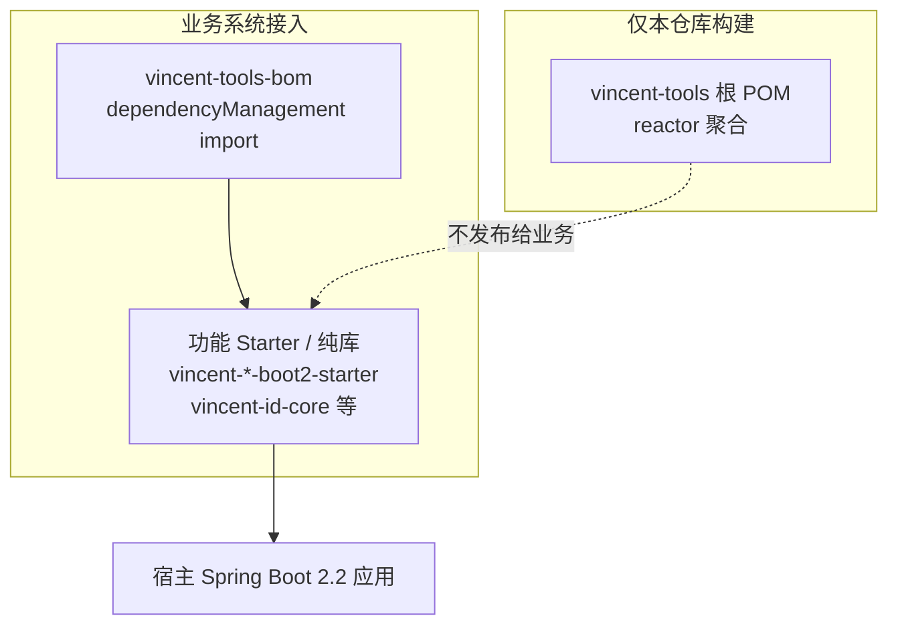
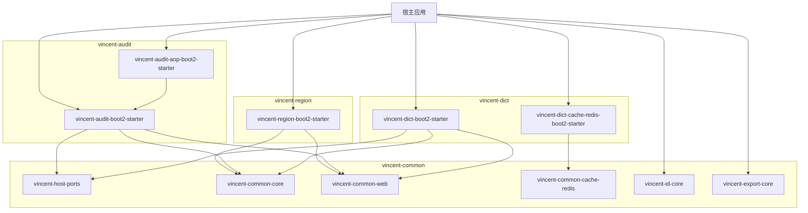
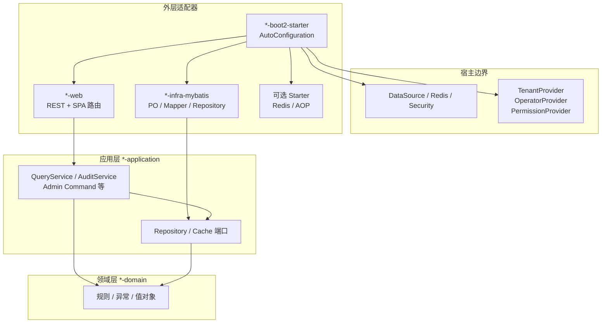
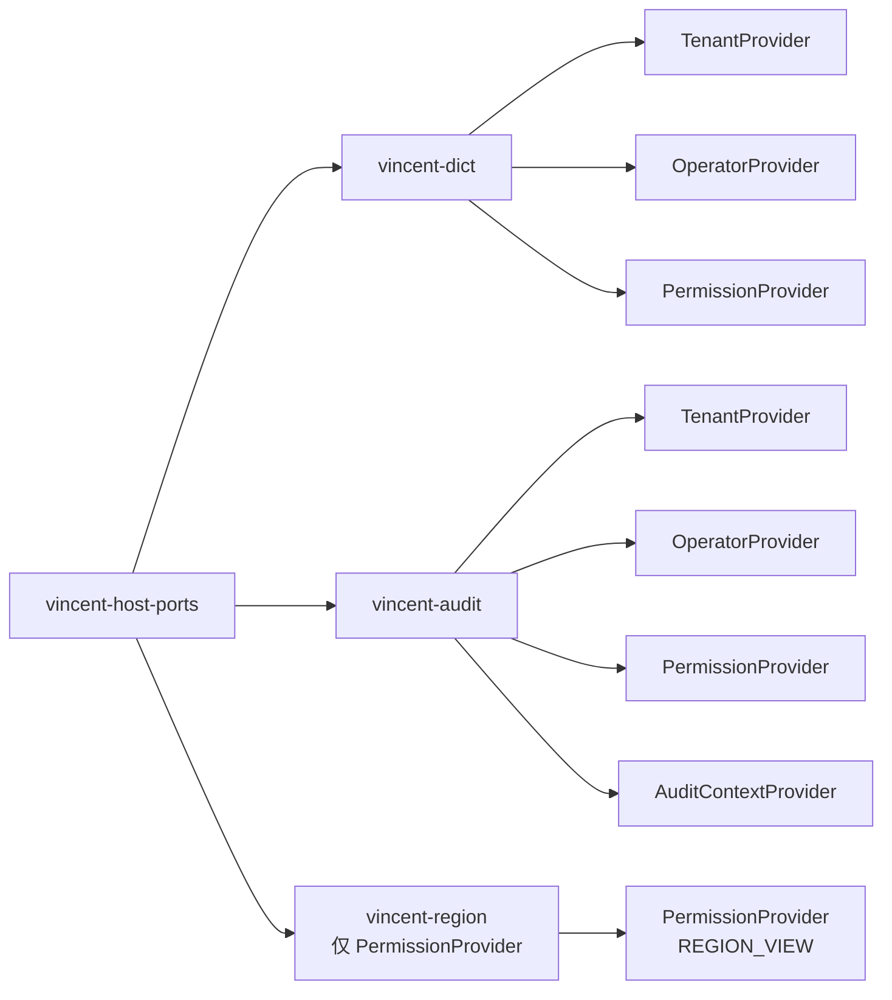

# Vincent Tools 整体架构

本文描述 `vincent-tools` 仓库的制品分层、模块关系与嵌入式组件模式。各工具细节见对应 `ARCHITECTURE.md`。

> **需求清单**（已交付 / 后续可选 / 未启动）：[REQUIREMENTS.md](../REQUIREMENTS.md)

| 工具 | 架构文档 |
| --- | --- |
| 共享层 `vincent-common` | [vincent-common/docs/ARCHITECTURE.md](../vincent-common/docs/ARCHITECTURE.md) |
| Vincent Dict | [vincent-dict/docs/ARCHITECTURE.md](../vincent-dict/docs/ARCHITECTURE.md) |
| Vincent Audit | [vincent-audit/docs/ARCHITECTURE.md](../vincent-audit/docs/ARCHITECTURE.md) |
| Vincent Region | [vincent-region/docs/ARCHITECTURE.md](../vincent-region/docs/ARCHITECTURE.md) |

---

## 1. 三种 Maven 制品

| 制品 | 坐标 | 用途 |
| --- | --- | --- |
| 根父 POM | `com.vincent.tools:vincent-tools` | 本仓库内部父工程，**业务系统勿继承** |
| BOM | `com.vincent.tools:vincent-tools-bom` | 对齐已发布 Vincent 制品版本 |
| 功能制品 | 各 Starter / 纯库 | 业务系统真正引入的依赖 |

---

## 2. 仓库模块全景

**Phase 状态（代码已合入 main）**

| Phase | 交付物 | 模式 |
| --- | --- | --- |
| 0 | `vincent-common` 共享模块 | 库 + 宿主端口 |
| 1 | `vincent-audit` core | 嵌入式 DDD + Starter |
| 2 | `vincent-audit-aop` | 可选 Starter |
| 3 | `vincent-id-core`、`vincent-export-core` | 纯 Java 库 |
| 4 | `vincent-region` | 嵌入式 DDD + Starter（只读） |

---

## 3. 嵌入式组件通用分层

Dict、Audit、Region 均采用**由外向内**的 DDD 分层；ID/Export 为无分层的纯库。

**依赖规则**

- 领域层：纯 Java，无 Spring / MyBatis / HTTP。
- 应用层：用例与端口，不依赖具体基础设施。
- 外层：Starter 选择宿主 DataSource、校验 Schema、条件注册 Bean。
- 业务系统**只依赖 Starter（或纯库）**，不直接依赖 domain/application。

---

## 4. 宿主端口复用

宿主实现一次 Provider，可同时接入 dict、audit、region 管理 API。

---

## 5. 数据与 Schema 策略

| 组件 | 表前缀 | Schema 版本表 | DDL 执行方 |
| --- | --- | --- | --- |
| Dict | `vin_dict_*` | `vin_dict_meta` | DBA 手工 SQL |
| Audit | `vin_audit_*` | `vin_audit_meta` | DBA 手工 SQL |
| Region | `vin_region_*` | `vin_region_meta` | DBA 手工 SQL |
| ID / Export | 无 | — | — |

应用启动时**只读校验** Schema 版本，永不自动建表/迁移。

---

## 6. 接入文档索引

| 工具 | 接入指南 |
| --- | --- |
| Dict | [vincent-dict/docs/INTEGRATION.md](../vincent-dict/docs/INTEGRATION.md) |
| Audit | [vincent-audit/docs/INTEGRATION.md](../vincent-audit/docs/INTEGRATION.md) |
| Region | [vincent-region/docs/INTEGRATION.md](../vincent-region/docs/INTEGRATION.md) |
| ID / Export | [vincent-common/docs/INTEGRATION.md](../vincent-common/docs/INTEGRATION.md) |

---

## 7. 实施计划索引

路线图 spec：[2026-08-15-vincent-tools-roadmap-design.md](../superpowers/specs/2026-08-15-vincent-tools-roadmap-design.md)

**需求总览**：[REQUIREMENTS.md](../REQUIREMENTS.md)

| Phase | 计划文档 |
| --- | --- |
| 0 | [phase0-common.md](../superpowers/plans/2026-08-15-vincent-tools-phase0-common.md) |
| 1 | [audit-phase1-core.md](../superpowers/plans/2026-08-15-vincent-audit-phase1-core.md) |
| 2 | [audit-phase2-aop.md](../superpowers/plans/2026-08-15-vincent-audit-phase2-aop.md) |
| 3 | [common-phase3-id-export.md](../superpowers/plans/2026-08-15-vincent-common-phase3-id-export.md) |
| 4 | [region-phase4-query.md](../superpowers/plans/2026-08-15-vincent-region-phase4-query.md) |
