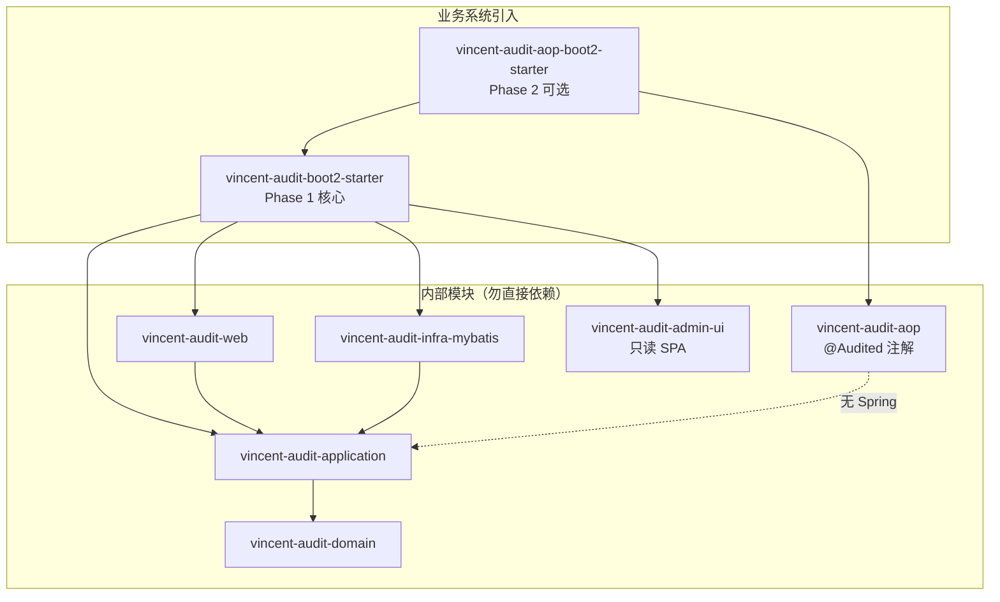
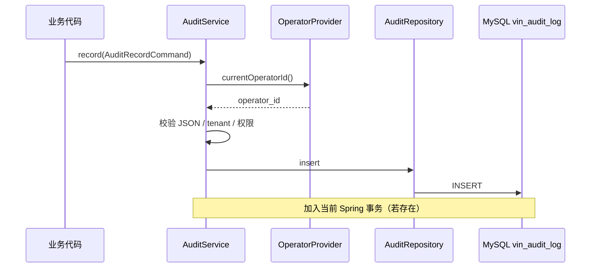
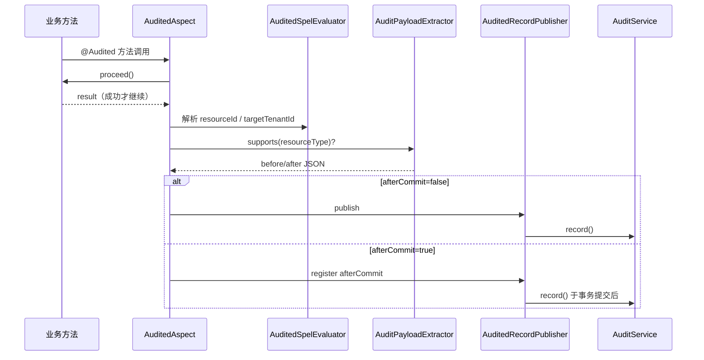
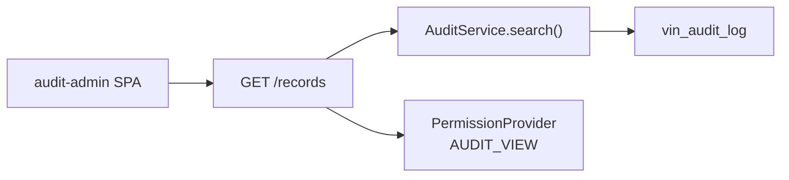
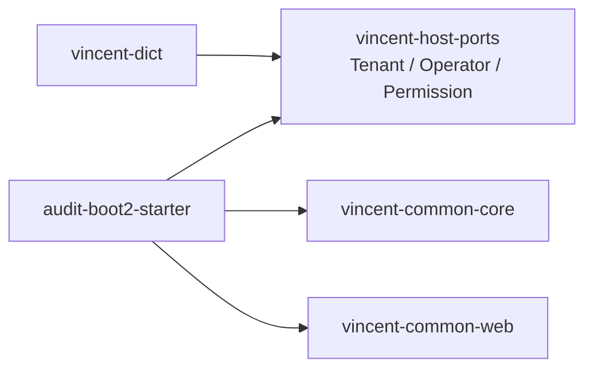

# Vincent Audit 架构

> 接入说明见 [INTEGRATION.md](INTEGRATION.md)。

## 1. 模块结构

| 模块 | 职责 |
| --- | --- |
| `domain` | 审计字段约束、异常码 |
| `application` | `AuditService.record()` / `search()`、`AuditRecordCommand` |
| `infra-mybatis` | 审计日志 PO、Mapper、Schema 校验 |
| `web` | 只读管理 REST + SPA 路由 |
| `admin-ui` | 只读检索 Vue SPA |
| `aop` | `@Audited`、`AuditPayloadExtractor` 端口（纯 Java） |
| `aop-boot2-starter` | `AuditedAspect`、SpEL、`afterCommit` 事务同步 |

---

## 2. 显式写入路径（Phase 1）

`operator_id` **始终**来自 `OperatorProvider`，不可由 command 伪造。

---

## 3. @Audited AOP 路径（Phase 2）

| 约束 | 说明 |
| --- | --- |
| 异常时不写审计 | 仅方法成功返回后触发 |
| 复杂场景 | 仍建议显式 `record()` |
| Extractor | 按 `resourceType` 匹配；无则 JSON 为 null |
| 开关 | `vincent.audit.aop.enabled=false` 关闭切面 |

---

## 4. 只读检索与管理端

管理端**只读**：无创建/修改/删除审计记录的 API。

---

## 5. 与 vincent-common / dict 共用

Audit 与 Dict 可共用同一 MySQL 库（`vin_audit_*` / `vin_dict_*`）与同一套 Provider 实现。

---

## 6. 关键设计约束

- Phase 1 与 Phase 2 **独立 artifact**；AOP 不修改 `AuditService` 契约。
- `@ConditionalOnBean(AuditService.class)` 注册 AOP。
- Schema 版本 `1`；无自动 TTL 清理（第一版永久保留）。
- `fail-fast` 控制写入失败是否抛异常。
