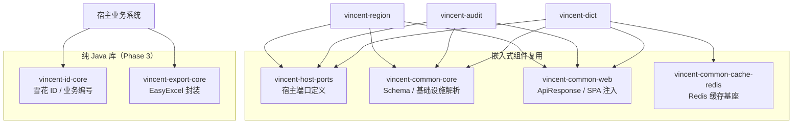
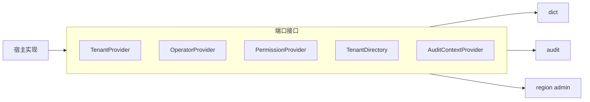
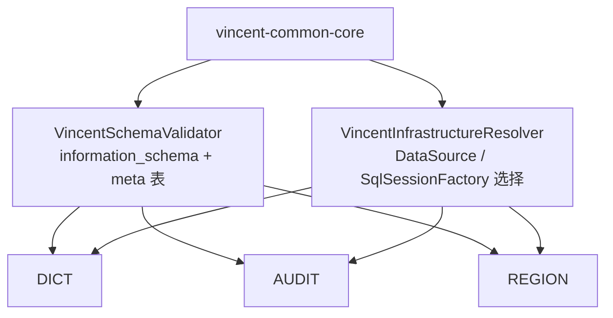
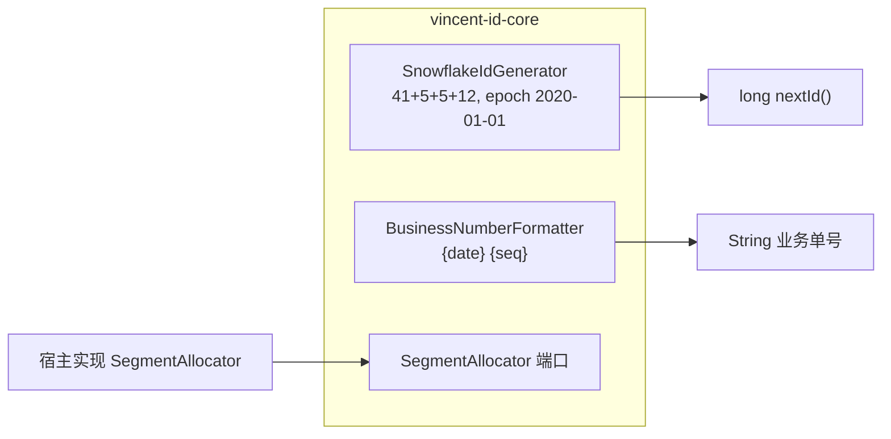
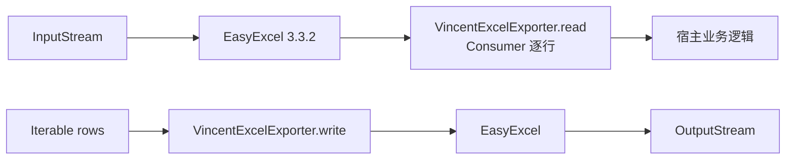

# Vincent Common 架构

> ID / Export 接入说明见 [INTEGRATION.md](INTEGRATION.md)。

## 1. 模块全景

| 模块 | 类型 | 消费者 |
| --- | --- | --- |
| `vincent-host-ports` | 端口接口 | dict、audit、region（部分） |
| `vincent-common-core` | 共享基础设施 | dict、audit、region Starter |
| `vincent-common-web` | Web 公共类型 | dict、audit、region web 层 |
| `vincent-common-cache-redis` | Redis 缓存 | dict cache starter |
| `vincent-id-core` | 纯库 | 任意 Java 8 项目 |
| `vincent-export-core` | 纯库 | 任意 Java 8 项目 |

---

## 2. vincent-host-ports

宿主在 Spring `@Configuration` 中注册 Bean；各组件通过构造注入使用，**不**提供默认实现。

---

## 3. vincent-common-core

统一 Schema 只读校验与多数据源解析逻辑，避免各组件重复实现。

---

## 4. vincent-id-core（Phase 3）

**无 Spring、无持久化**；多实例 worker/datacenter ID 由宿主分配。

---

## 5. vincent-export-core（Phase 3）

薄封装：统一读写入口，不暴露 POI；DTO 使用 `@ExcelProperty`。

---

## 6. 依赖原则

- `vincent-host-ports`：零 Spring 依赖，可被 domain 层间接引用。
- `vincent-id-core` / `vincent-export-core`：独立发布，不依赖 host-ports。
- 嵌入式组件**不得**反向依赖 id/export（除非未来 explicit 集成场景）。
