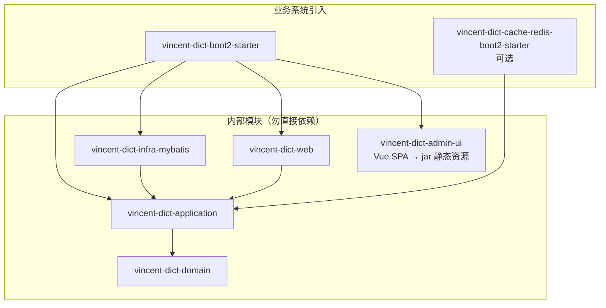
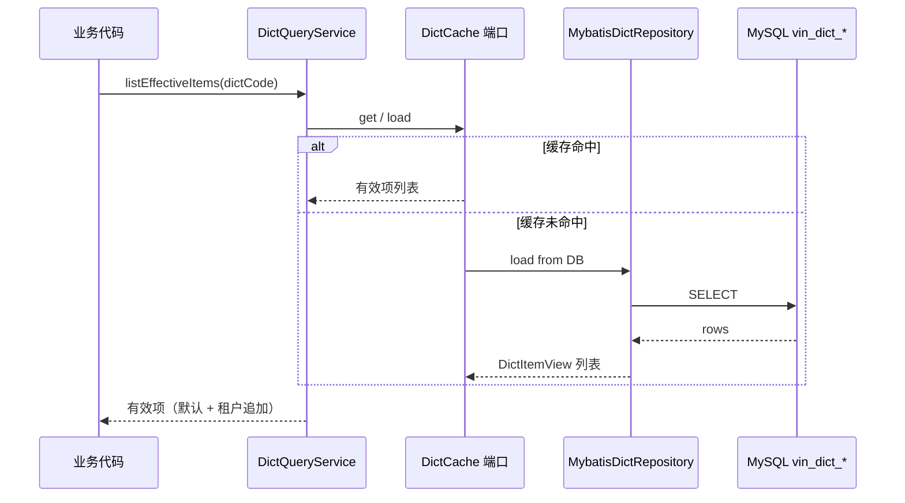
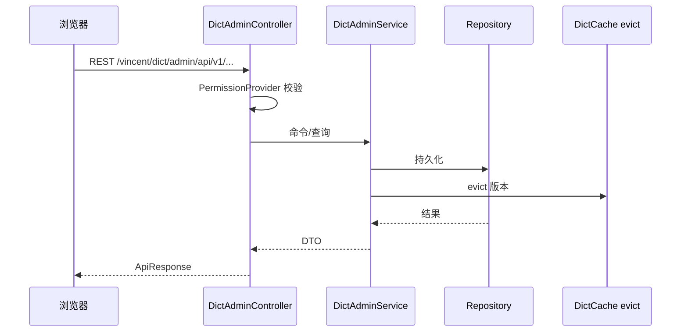
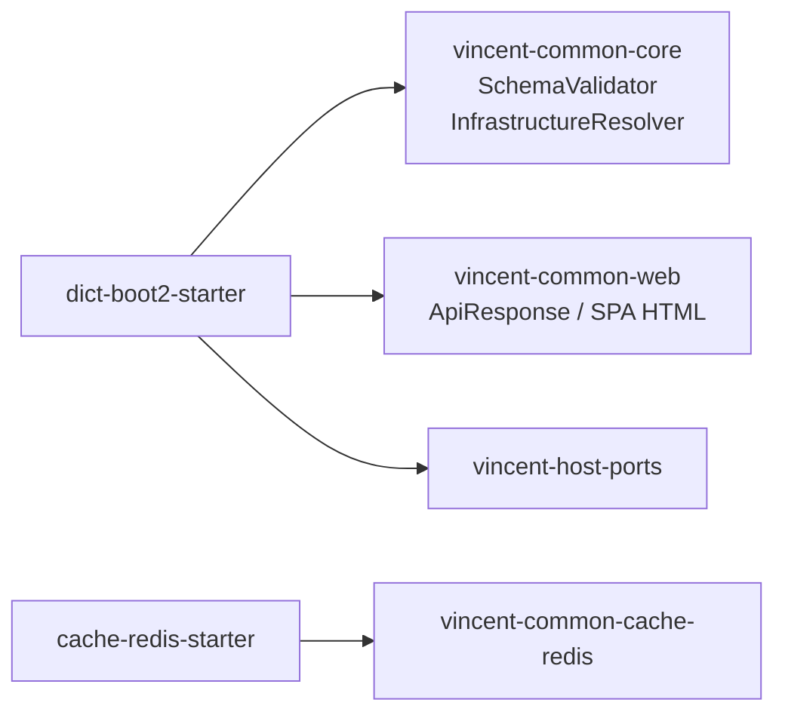

# Vincent Dict 架构

> 接入说明见 [INTEGRATION.md](INTEGRATION.md)。领域规则详见 [设计 spec](../../docs/superpowers/specs/2026-08-14-vincent-dict-design.md)。

## 1. 模块结构

| 模块 | 职责 |
| --- | --- |
| `domain` | 字典/条目聚合、编码规则、领域异常 |
| `application` | `DictQueryService`、管理命令服务、仓储/缓存端口 |
| `infra-mybatis` | PO、Mapper、仓储实现、Schema 校验 |
| `web` | 管理 REST API、SPA 路由、异常映射 |
| `admin-ui` | Vue 3 管理端，打包进 Starter |
| `boot2-starter` | 自动装配、条件 Bean、UI 资源聚合 |
| `cache-redis-boot2-starter` | 可选 Redis 旁路缓存 |

---

## 2. 运行时数据流（查询）

多租户：`TenantProvider` 提供当前租户；批处理使用显式租户 API。

---

## 3. 管理端数据流

---

## 4. 与 vincent-common 的关系

---

## 5. 关键设计约束

- 依赖只能由外向内；Controller/Mapper 不得复制领域规则。
- Schema 版本 `1`，手工 SQL 初始化，启动只读校验。
- 管理端需 `OperatorProvider` + `PermissionProvider`；查询端仅需 `TenantProvider`（多租户时）。
- Redis 缓存为可选旁路；未启用时直读 MySQL。
