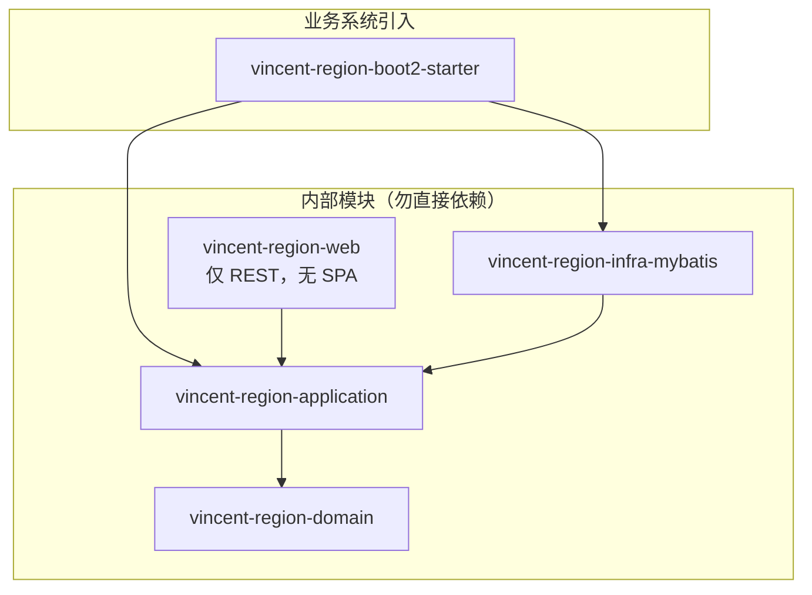
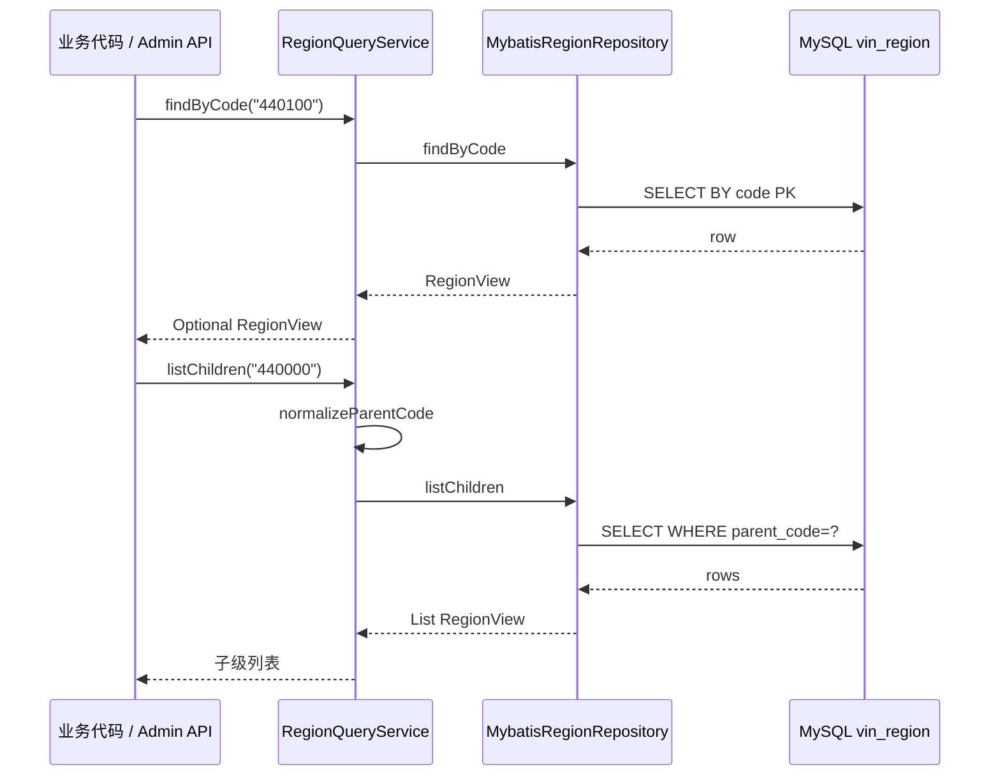
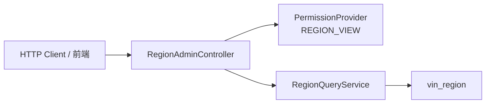
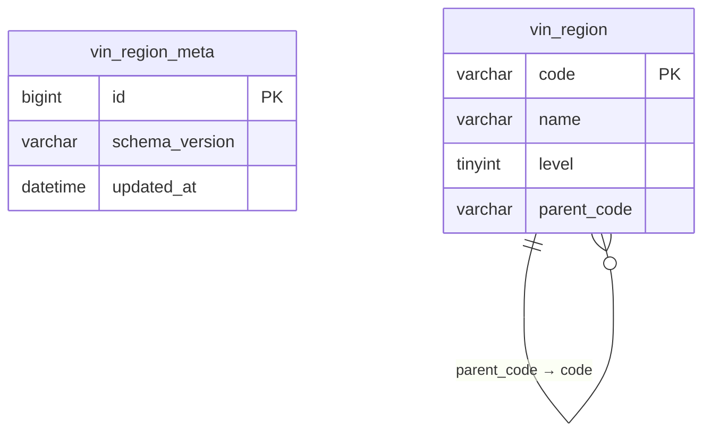
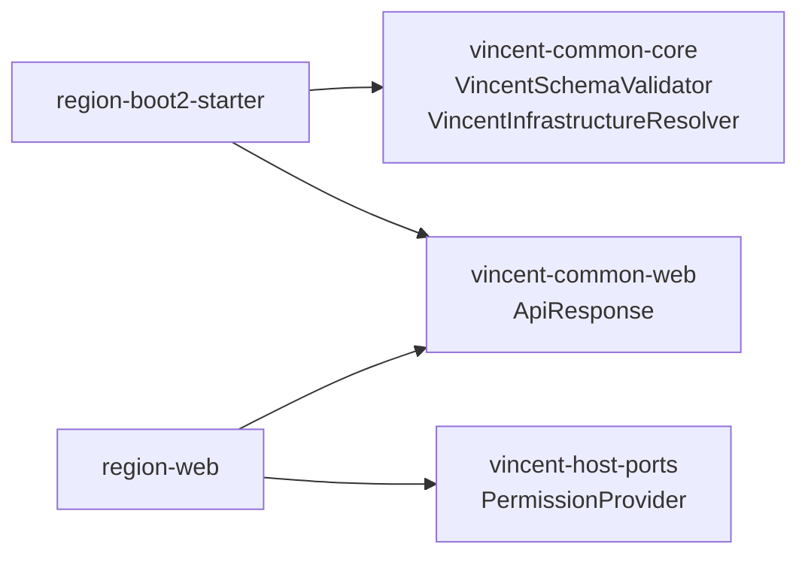

# Vincent Region 架构

> 接入说明见 [INTEGRATION.md](INTEGRATION.md)。

## 1. 模块结构

| 模块 | 职责 |
| --- | --- |
| `domain` | 字段约束、`RegionErrorCode`、`RegionException` |
| `application` | `RegionQueryService`（`findByCode` / `listChildren`） |
| `infra-mybatis` | `vin_region` 表读写、按 `parent_code` 索引查询 |
| `web` | 只读管理 REST（`REGION_VIEW`） |
| `boot2-starter` | Schema 校验、DataSource 解析、条件 Bean |

**与 audit/dict 的差异**

- 无 `TenantProvider` / `OperatorProvider` 依赖（核心查询）
- 无写入 API、无 admin-ui SPA
- 数据由 DBA 执行 `001-init.sql` + `001-data.sql` 维护

---

## 2. 查询数据流

`parentCode` 为 `null`、空串或 `"0"` 时归一化为省级查询。

---

## 3. 只读管理 API

| 端点 | 说明 |
| --- | --- |
| `GET /{code}` | 单条查询 |
| `GET /children?parentCode=` | 子级列表 |

---

## 4. 数据模型

| level | 含义 |
| --- | --- |
| 1 | 省/直辖市 |
| 2 | 市 |
| 3 | 区/县 |

`RegionView` 对外只暴露 `code/name/level/parentCode`，不暴露 DB  surrogate key。

---

## 5. 与 vincent-common 的关系

---

## 6. 关键设计约束

- 领域层无 Spring/MyBatis 依赖。
- 启动只读 Schema 校验；应用永不执行 DDL。
- 首版样本数据（北京、广东）；全量国标需后续扩展 `001-data.sql`。
- UTF-8：JDBC `characterEncoding=UTF-8` + SQL 导入 `utf8mb4`。
